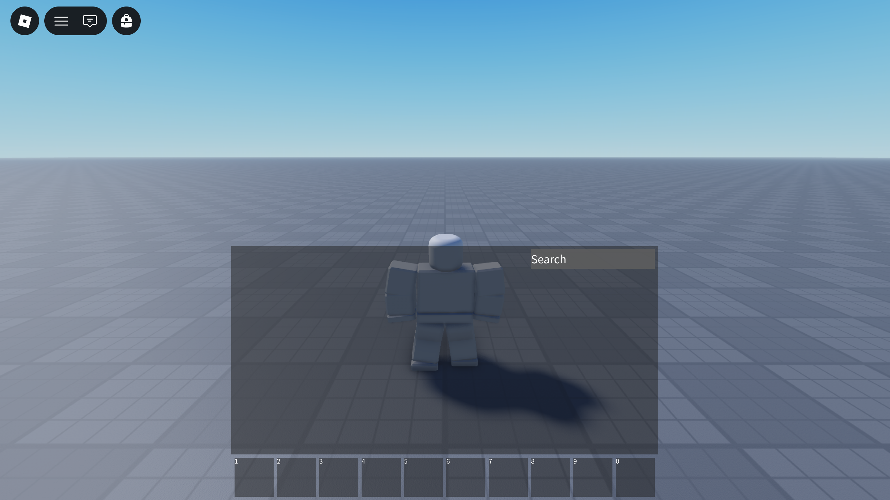

<h1 align="center">
  
   
  Purse
</h1>

  
  
  
  
  
  

Purse is a fork of the [default Roblox backpack](https://github.com/Roblox/Core-Scripts/blob/master/CoreScriptsRoot/Modules/BackpackScript.lua) decoupled from the CoreGui, allowing developers access to APIs that were previously unavailable and allowing for code modifications.

For more information, see the [documentation](https://purse.luau.page/).

## Upstream Repo

Mirroring `829cb13cc98870ddbcf4ba6bd48b774a87ae549f` on the [Roblox Client Tracker](https://github.com/MaximumADHD/Roblox-Client-Tracker).

> https://github.com/MaximumADHD/Roblox-Client-Tracker/blob/829cb13cc98870ddbcf4ba6bd48b774a87ae549f/scripts/CoreScripts/Modules/BackpackScript.lua

## License

Purse is available under the Apache 2.0 license. See [LICENSE.md](LICENSE.md) for details.
