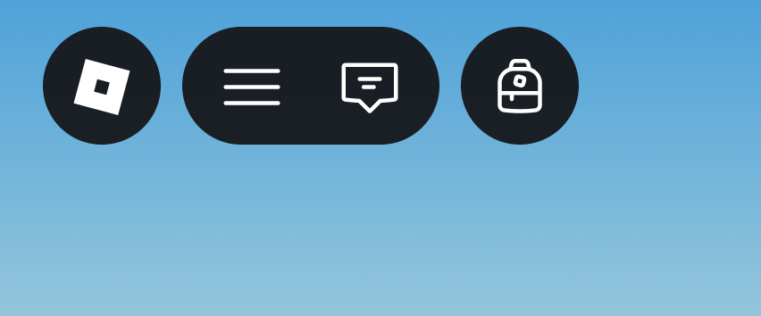

Through source code modifications, you can change Purse's behavior and appearance. Here are a few examples of what you can do with Purse.

## Changing Equip Color

You can change the slot's equip color, which is blue, by modifying the `SLOT_EQUIP_COLOR` constant in its source.

The following code sample changes the equip color to red.

``` lua linenums="44" hl_lines="2"
--8<-- "src/init.luau:44:44"
local SLOT_EQUIP_COLOR = Color3.new(233 / 255, 90 / 255, 90 / 255) -- (1)!
--8<-- "src/init.luau:46:49"
```

1.  Changed from blue `#!lua Color3.new(90 / 255, 142 / 255, 233 / 255)` to red `#!lua Color3.new(233 / 255, 90 / 255, 90 / 255)`


## Increasing Hotbar Slots and Inventory Rows

Purse shows a set number of hotbar slots and inventory rows based on the device.


/// caption
Computer, console, and VR have 10 hotbar slots and 4 inventory rows
///


/// caption
Phone and tablet devices have 3 hotbar slots and 2 inventory rows
///

It's possible to increase the number of hotbar slots and inventory rows shown by changing the constants in the source code.

!!! note

    Formerly VR devices used different constants for hotbar slots and inventory rows but now use the same as computer and console devices.

    `HOTBAR_SLOTS_VR` and `INVENTORY_ROWS_VR` are no longer used but are still included in the code. VR devices now use `INVENTORY_ROWS_FULL` and `HOTBAR_SLOTS_FULL`.

``` lua linenums="62"
--8<-- "src/init.luau:62:72"
```

Constants suffixed with `_FULL` are for computer, console, and VR devices while constants suffixed with `_MINI` are for phone and tablet devices.

The following code sample changes phone and tablet devices to have 5 hotbar slots.

``` lua linenums="62" hl_lines="3"
--8<-- "src/init.luau:62:63"
local HOTBAR_SLOTS_MINI = 5 -- (1)!
--8<-- "src/init.luau:65:66"
```

1.  Changed from 3 hotbar slots to 5 hotbar slots


## Removing Topbar Icon

The topbar icon is decoupled from Purse's functionality, so you can remove it by disabling the [`TopbarIcon`][TopbarIcon] script. In addition, a [`ContextAction`][ContextAction] script is included to bind opening and closing the inventory to a keycode (set to backquote <kbd>`</kbd> by default).


/// caption
Topbar icon enabled
///


/// caption
Topbar icon disabled
///

Your explorer window should look similar to the following when you disable the `TopbarIcon` script and enable the `ContextAction` script.


!!! warning

    If you do not enable the `ContextAction` script, players will not be able to open the backpack since the topbar icon which handles binding is disabled.

  [TopbarIcon]: https://github.com/ryanlua/purse/blob/main/src/TopbarIcon.client.luau
  [ContextAction]: https://github.com/ryanlua/purse/blob/main/src/ContextAction.client.luau